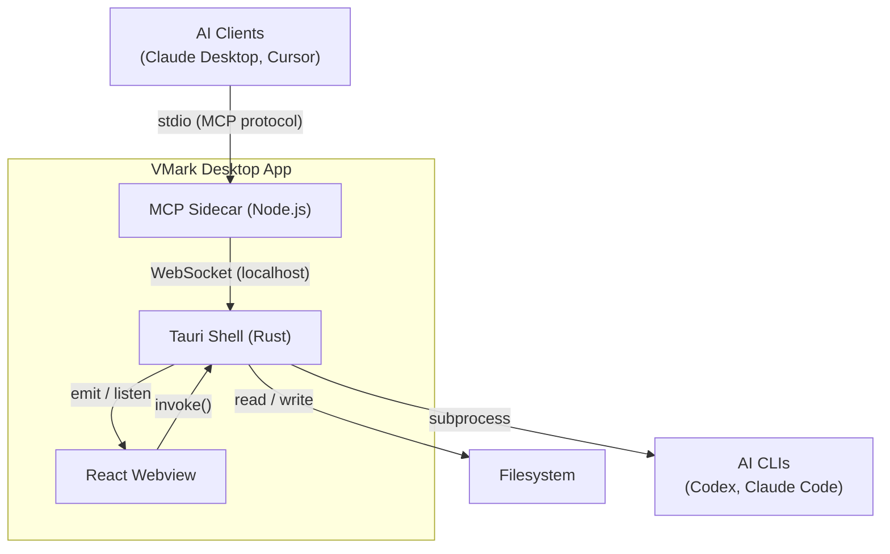

# VMark System Architecture

> Scope: System-level orientation for developers and AI agents. Read this first
> when joining the project or starting a new session.

## System Shape

VMark is a desktop Markdown editor built on three cooperating processes:



## Three Processes

| Process       | Runtime                   | Entry Point                    | Role                                                                |
| ------------- | ------------------------- | ------------------------------ | ------------------------------------------------------------------- |
| Tauri Shell   | Rust                      | `src-tauri/src/lib.rs`         | Window management, file I/O, menus, AI provider routing, MCP bridge |
| React Webview | Browser (WebView2/WebKit) | `src/main.tsx` → `src/App.tsx` | Editor UI, stores, plugins, keyboard shortcuts                      |
| MCP Sidecar   | Node.js (bundled)         | `vmark-mcp-server/src/cli.ts`  | MCP protocol handler, tool registration, AI client communication    |

## Entry Points

### Rust Backend (`src-tauri/src/`)

| File                | Role                                                                           |
| ------------------- | ------------------------------------------------------------------------------ |
| `lib.rs`            | App bootstrap — plugin registration, command handlers, window setup            |
| `menu.rs`           | Menu construction (TWO builders: `create_menu` + `create_menu_with_shortcuts`) |
| `menu_events.rs`    | Generic menu dispatcher — emits `menu:{id}` to focused window                  |
| `window_manager.rs` | Window lifecycle — create, close, focus, tab transfer                          |
| `mcp_bridge.rs`     | WebSocket server for MCP sidecar communication                                 |
| `mcp_server.rs`     | Sidecar process management — start, health check, restart                      |
| `ai_provider.rs`    | CLI-based AI provider detection and prompt execution                           |
| `hot_exit/`         | Capture and restore full app state across restarts                             |
| `watcher.rs`        | Filesystem watcher for external file changes                                   |
| `file_tree.rs`      | Workspace file tree scanning                                                   |
| `genies.rs`         | AI Genie prompt management                                                     |

### React Frontend (`src/`)

| Directory          | Count       | Role                                                                       |
| ------------------ | ----------- | -------------------------------------------------------------------------- |
| `stores/`          | 39 stores   | Zustand state — documents, tabs, settings, editor, UI                      |
| `hooks/`           | 67 hooks    | Side effects — file ops, menu events, auto-save, shortcuts                 |
| `plugins/`         | 70 plugins  | ProseMirror/Tiptap/CodeMirror editor plugins                               |
| `components/`      | 8 top-level | Editor, Sidebar, Tabs, StatusBar, TitleBar, FindBar, Terminal, GeniePicker |
| `utils/`           | \~77 files  | Helpers, markdown pipeline, cursor sync, hot exit                          |
| `hooks/mcpBridge/` | (subdir)    | Frontend handlers for MCP tool calls                                       |

### MCP Sidecar (`vmark-mcp-server/src/`)

| File / Dir  | Role                                                               |
| ----------- | ------------------------------------------------------------------ |
| `cli.ts`    | CLI entry — `--stdio`, `--version`, `--health-check` flags         |
| `server.ts` | MCP server setup — tool/resource registration                      |
| `tools/`    | 19 tool modules (editor, formatting, blocks, tables, genies, etc.) |
| `bridge/`   | WebSocket client + message types for Tauri communication           |
| `types.ts`  | Shared type definitions                                            |

## Key Data Flows

### 1. Menu Event → Frontend Action

```
User clicks menu item
  → Tauri menu handler (menu_events.rs)
  → emit("menu:{id}") to focused window
  → frontend listen("menu:{id}") in useUnifiedMenuCommands
  → dispatches to store action or hook callback
```

### 2. File Open from Finder (macOS)

```
Finder double-clicks .md file
  → macOS sends file-open event to Tauri
  → lib.rs queues in PENDING_FILE_OPENS (if frontend not ready)
     OR emits "open-file" event (if frontend ready)
  → useFinderFileOpen hook receives event
  → creates tab via tabStore + loads content via documentStore
```

### 3. MCP Tool Call from AI Client

```
AI client sends tool call via stdio
  → MCP sidecar (server.ts) receives and validates
  → sidecar sends WebSocket message to Tauri (bridge/websocket.ts)
  → mcp_bridge.rs forwards to frontend via emit("mcp-request")
  → mcpBridge/ handler executes operation on editor
  → response flows back: frontend → mcp_bridge.rs → sidecar → AI client
```

### 4. Document Edit Cycle

```
User types in WYSIWYG editor
  → Tiptap transaction updates ProseMirror doc
  → onUpdate callback serializes to Markdown (markdownPipeline/)
  → documentStore.updateContent(tabId, markdown)
  → useAutoSave detects change, debounces
  → saveToPath writes to filesystem via Tauri invoke
```

### 5. AI Genie Invocation

```
User triggers Genie (Cmd+G or menu)
  → GeniePicker shows available genies
  → user selects genie → geniePickerStore dispatches
  → useGenieInvocation builds prompt with document context
  → invoke("execute_ai_prompt") → ai_provider.rs
  → ai_provider detects best CLI tool, spawns subprocess
  → streams response via Tauri events → frontend applies result
```

## Module Map

| Directory               | Files  | Role                         | Imports From                                    |
| ----------------------- | ------ | ---------------------------- | ----------------------------------------------- |
| `src/stores/`           | 39     | State management             | (leaf — nothing from components/plugins)        |
| `src/hooks/`            | 67     | Side effects, event handling | stores, utils, Tauri API                        |
| `src/plugins/`          | 70     | Editor extensions            | stores, utils, shared plugins                   |
| `src/components/`       | 8 dirs | React UI                     | stores, hooks, plugins, utils                   |
| `src/utils/`            | \~77   | Helpers + services           | stores (service utils), pure logic (core utils) |
| `src/lib/`              | 1 dir  | CJK formatter                | stores (settings)                               |
| `src/types/`            | \~5    | Type definitions             | plugins (format types)                          |
| `src-tauri/src/`        | 24     | Rust backend                 | (self-contained)                                |
| `vmark-mcp-server/src/` | \~25   | MCP sidecar                  | (self-contained)                                |

## Dependency Flow

```
  components
      │
      ├── hooks ──── stores (leaf)
      │     │
      │     └── utils/services
      │
      └── plugins ── utils/pure
                       │
                       └── (no upward imports)
```

**Enforced by:** `dependency-cruiser` (`.dependency-cruiser.cjs`). Run
`pnpm lint:deps` to check. Key rules:

1. **No circular dependencies** (error)
2. **Stores must not import components** (error)
3. **Leaf utils must not import upward** (error, with exemptions for service utils)
4. **Plugin isolation** (warn, with exemptions for coordination plugins)

See `.dependency-cruiser-known-violations.json` for baselined exceptions.

## Key Design Decisions

| ADR                                                           | Decision                      | Rationale                                           |
| ------------------------------------------------------------- | ----------------------------- | --------------------------------------------------- |
| [ADR-001](decisions/ADR-001-markdown-as-source-of-truth.md)   | Markdown as source of truth   | Engine-agnostic document format                     |
| [ADR-002](decisions/ADR-002-mcp-sidecar-architecture.md)      | MCP sidecar architecture      | Separation of concerns, MCP ecosystem compatibility |
| [ADR-003](decisions/ADR-003-tiptap-over-milkdown.md)          | Tiptap over Milkdown          | Thinner ProseMirror wrapper, better debugging       |
| [ADR-004](decisions/ADR-004-human-oriented-mcp-tools.md)      | Human-oriented MCP tools      | Backward compatibility + AI introspection           |
| [ADR-005](decisions/ADR-005-cli-based-ai-provider-routing.md) | CLI-based AI provider routing | Zero key management, subscription pricing           |

