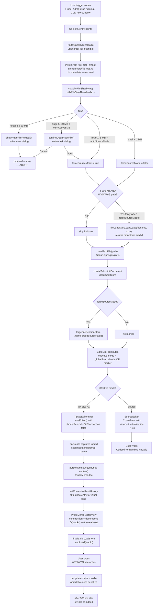

# Large-File Open Pipeline

> Status: Active. Landed with `feat/large-file-ux` (2026-04-22). Implements `dev-docs/plans/20260422-large-file-open-ux.md`.

Describes the exact path a file takes from click to interactive editor, and the optimizations layered along it.

## Pipeline overview

## Size tiers

Centralized in `src/utils/fileSizeThresholds.ts`.

| Threshold | Value | Purpose | User-togglable? |
| --- | ---: | --- | --- |
| `SHOW_PROGRESS_BYTES` | 300 KB | At/above this, show the indeterminate indicator | No (cosmetic) |
| `SOURCE_MODE_DEFAULT_BYTES` | 1 MB | At/above this, auto-open in Source mode | Yes (`largeFile.autoSourceMode`) |
| `WARN_BEFORE_OPEN_BYTES` | 5 MB | At/above this, show a pre-open warning dialog | Yes (`largeFile.warnAbove5MB`) |
| `HARD_REFUSE_BYTES` | 50 MB | At/above this, refuse entirely | No (liability floor) |

Byte count is a coarse proxy for the real bottleneck (block count), but it's free to compute via `fs::metadata` while block count requires parsing — ~5% of the pain we're trying to avoid. The defaults are calibrated against the 1.4 MB / 2 250-block corpus from the plan.

## Step-by-step

1. **Entry.** Five entry points — `useFinderFileOpen`, `useDragDropOpen`, `useFileOpen.handleOpen` / `openFileInNewTabCore`, `WindowContext` launch args, and the "open file in new window" Tauri command — all funnel through one helper.
2. **Pre-read size check.** `routeOpenBySize(path)` invokes the Rust `get_file_size_bytes` command. A bare `fs::metadata` — no file content touches memory. The Rust side canonicalizes the path and verifies it's a regular file (rejects directories and broken symlinks).
3. **Tier decision.** `classifyFileSize(bytes)` classifies into `small`, `large`, `huge`, or `refused`. Settings modulate the route:
   - `largeFile.autoSourceMode = false` demotes `large` to WYSIWYG.
   - `largeFile.warnAbove5MB = false` skips the `huge` confirm dialog but keeps Source-mode routing.
4. **Dialog gate (if needed).** `refused` → native error dialog, abort. `huge` with warning on → native confirm; cancel aborts. Both are pre-read — nothing is loading yet.
5. **Indicator (optional).** For ≥ 300 KB WYSIWYG opens only, `fileLoadStore.startLoad` returns a monotonic `loadId`; the StatusBar spinner fades in after 150 ms so small opens never flash it.
6. **Read + init.** `readTextFile` → `createTab` → `initDocument` → `setLineMetadata`. Tab and document stores now hold the content.
7. **Forced-source marker.** If `forceSourceMode`, `largeFileSessionStore.markForcedSource(tabId)` records a per-tab override.
8. **Mode resolution.** `Editor.tsx` renders either `SourceEditor` or `TiptapEditorInner` based on `effective = globalSourceMode || forcedSource[tabId]`. The marker wins over the global for that tab alone.
9. **Source-mode path.** CodeMirror's viewport virtualization renders only visible lines — sub-second for a 1.4 MB / 2 250-block document.
10. **WYSIWYG path.** `TiptapEditorInner.onCreate` captures `loadIdAtMount`, then `setTimeout(0)` defers the heavy parse so the empty editor shell paints first. Inside the timeout: `parseMarkdown` (~ 700 ms), `setContentWithoutHistory` (skip undo pollution), then ProseMirror's `EditorView` construction + decoration pass (the real bottleneck, O(blocks)).
11. **Indicator clear.** The `finally` block calls `fileLoadStore.endLoad(loadIdAtMount)`. The `loadId` ownership means a stale completion from a previous tab cannot clear a newer indicator.
12. **Steady state.** In WYSIWYG, every `onUpdate` strips `.cv-idle` (disabling `content-visibility: auto`) so ProseMirror's DOM diff doesn't pay the off-screen-block reflow cost, then schedules a 500 ms debounce that re-adds `.cv-idle` and serializes back to markdown.

## Measured numbers (1.4 MB / 42 376 lines / 2 250 blocks corpus)

Measured 2026-04-22 in the running Tauri app via MCP instrumentation:

| Milestone | Δ from invoke (before) | After plan (target) |
| --- | ---: | ---: |
| IPC returns (window exists) | 62 ms | 62 ms |
| First paint (empty editor shell) | 476 ms | 476 ms |
| Content rendered (Source mode) | n/a | **< 1 s** |
| Content rendered (WYSIWYG) | ~ 16 000 ms | ~ 16 000 ms (unchanged) |
| Main thread free for input (Source) | n/a | **< 1 s** |
| Main thread free for input (WYSIWYG) | ~ 16 070 ms | ~ 16 070 ms + visible indicator |

Bench decomposition (no editor mount, from `src/bench/largeFile.bench.ts`):

- Markdown → ProseMirror parse: 702 ms mean (p99 919 ms)
- Serialize: 16 ms
- Pure PM `state.apply()` per keystroke: ~ 1.8 µs

The 15.5-second block is **not parse** — it is **ProseMirror ****`EditorView`**** construction + decoration pass over 2 250 block nodes**. Parse is ~ 5 % of the total. This is why Source mode (which virtualizes the viewport) is the real fix, not parse optimization.

## Optimization strategies by layer

### 1. Entry-level (cheapest gate first)

- **One `routeOpenBySize` helper** replaces five parallel implementations — every open path honors the same UX.
- **Byte count as a cheap proxy** for block count (the real cost): parse-free, ~ nanoseconds.
- **50 MB hard refusal** as a liability floor — prevents webview OOM from arbitrary strings.

### 2. Sidestep the expensive path when possible

- **Source mode for anything ≥ 1 MB.** CodeMirror has built-in viewport virtualization; ProseMirror does not. Measured: ~ 15.5 s → < 1 s on the 1.4 MB corpus.
- **Per-tab forced-source override.** Switching one large file to WYSIWYG doesn't force-load every other tab in the window. `Editor.tsx`, `StatusBar.tsx`, and `useUnifiedHistory.toggleSourceModeWithCheckpoint` all compose effective mode from `global || forcedMarker`.

### 3. Honest UI under unavoidable waits

- **Indeterminate spinner, not fake progress.** While ProseMirror builds the view the main thread is frozen; sub-phase progress would be a lie.
- **`fileLoadStore.loadId`** (monotonic) scopes `endLoad` so concurrent multi-file opens can't clear each other's indicator.
- **150 ms fade-in delay** + CSS-only animation prevents flashing on fast opens.
- **`prefers-reduced-motion`** respected (spinner animation suppressed).

### 4. TiptapEditor perf hardening (shipped alongside the plan in `41b311b1`)

- **`shouldRerenderOnTransaction: false`** — VMark reads editor state through Zustand selectors, so Tiptap's default full-React rerender per transaction is wasted work.
- **Deferred initial parse via `setTimeout(0)`** — the empty shell paints first; the 700 ms parse runs after layout.
- **Adaptive debounce (100 ms – 5 s)** scales with doc size so serialization keeps pace with input on small docs but doesn't thrash on big ones.
- **`.cv-idle` gating.** `content-visibility: auto` has an O(blocks-after-insertion) reflow cost — 378 ms per keystroke on a 2 250-block doc in Chromium. The class is stripped during typing (`onUpdate`) and re-applied after 500 ms idle so scroll and initial paint keep the optimization.
- **Native spellcheck disabled above 100 K chars** where rescans block the main thread.
- **Content-drift re-sync** — if content changed while the deferred parse was pending, a post-parse check flushes the fresh value to the editor.
- **Footnote popup hover state per-`EditorView`** via `WeakMap` — multi-window instances no longer race on a shared module timer.

### 5. User escape hatches

- **`largeFile.autoSourceMode`** toggle: force 1–5 MB files back into WYSIWYG.
- **`largeFile.warnAbove5MB`** toggle: skip the confirm dialog for 5–50 MB files.
- **StatusBar "Switch to WYSIWYG"** link on any tab that was auto-routed — per-tab, reversible, not persisted.

## What we deliberately didn't do

- **Web Worker parse.** Parse is ~ 700 ms of ~ 15 500 ms total block. Crossing the worker boundary with a 2 250-node PM document and re-hydrating schema/marks costs most of that savings.
- **Chunked parse yielding to the event loop.** Same math — insufficient return for the complexity.
- **True block virtualization à la Notion.** ProseMirror's `EditorView` assumes the full DOM mirrors the doc; virtualizing breaks selection mapping, contenteditable semantics, and find-across-doc. Community plugins are unmaintained.
- **Phase C (deferred NodeView upgrade).** The plan requires a Tauri native perf profile first (attributing the 15.5 s block to specific call sites). Shipping a refactor without that profile would likely rediscover what `codePreview`'s widget decorations already do.

## File map

| Concern | File |
| --- | --- |
| Thresholds + classifier | `src/utils/fileSizeThresholds.ts` |
| Open router (the gate) | `src/utils/largeFileRouting.ts` |
| Native warn/refuse prompts | `src/utils/largeFilePrompts.ts` |
| Rust size-check command | `src-tauri/src/file_ops.rs` |
| Per-tab forced-source marker | `src/stores/largeFileSessionStore.ts` |
| Indeterminate indicator state | `src/stores/fileLoadStore.ts` |
| StatusBar indicator widget | `src/components/StatusBar/FileLoadIndicator.tsx` |
| StatusBar upgrade offer | `src/components/StatusBar/SourceModeUpgrade.tsx` |
| Entry: Finder | `src/hooks/useFinderFileOpen.ts` |
| Entry: drag-drop | `src/hooks/useDragDropOpen.ts` |
| Entry: Open dialog / menu | `src/hooks/useFileOpen.ts` |
| Entry: launch args / new window | `src/contexts/WindowContext.tsx` |
| Effective-mode composition | `src/components/Editor/Editor.tsx`, `src/components/StatusBar/StatusBar.tsx`, `src/hooks/useUnifiedHistory.ts`, `src/hooks/useUnifiedMenuCommands.ts` |
| Deferred parse + indicator clear | `src/components/Editor/TiptapEditor.tsx` |
| Tab-close cleanup | `src/hooks/tabCleanup.ts` |
| User settings panel | `src/pages/settings/EditorSettings.tsx` |
| End-user documentation | `website/guide/large-files.md` |
| Original plan | `dev-docs/plans/20260422-large-file-open-ux.md` |
