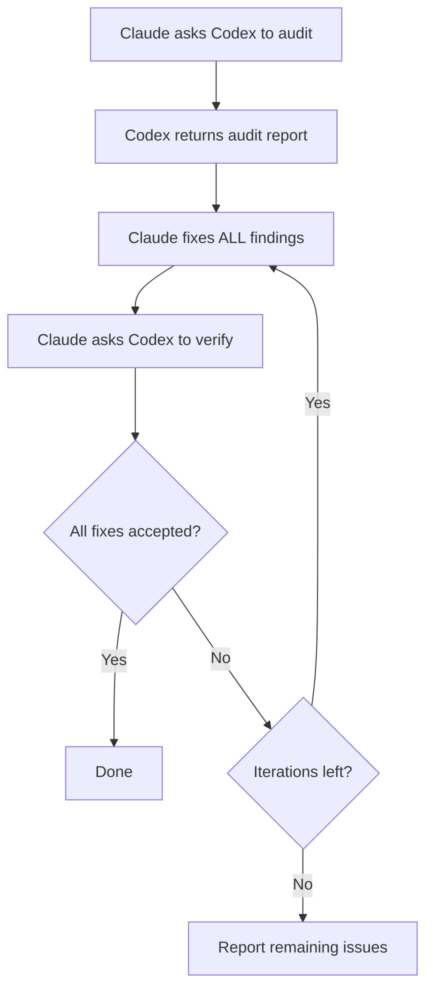

# Cross-Model Verification

VMark uses two AI models that challenge each other: **Claude writes the code, Codex audits it**. This adversarial setup catches bugs that a single model would miss.

## Why Two Models Are Better Than One

Every AI model has blind spots. It might consistently miss a category of bugs, favor certain patterns over safer alternatives, or fail to question its own assumptions. When the same model writes and reviews code, those blind spots survive both passes.

Cross-model verification breaks this:

1. **Claude** (Anthropic) writes the implementation — it understands the full context, follows project conventions, and applies TDD.
2. **Codex** (OpenAI) audits the result independently — it reads the code with fresh eyes, trained on different data, with different failure modes.

The models are genuinely different. They were built by separate teams, trained on different datasets, with different architectures and optimization targets. When both agree the code is correct, your confidence is much higher than a single model's "looks good to me."

Research supports this approach from multiple angles. Multi-agent debate — where multiple LLM instances challenge each other's responses — significantly improves factuality and reasoning accuracy[^1]. Role-play prompting, where models are assigned specific expert roles, consistently outperforms standard zero-shot prompting on reasoning benchmarks[^2]. And recent work shows that frontier LLMs can detect when they are being evaluated and adjust their behavior accordingly[^3] — meaning a model that knows its output will be scrutinized by another AI is likely to produce more careful, less sycophantic work[^4].

### What Cross-Model Catches

In practice, the second model finds issues like:

- **Logic errors** the first model introduced confidently
- **Edge cases** the first model didn't consider (null, empty, Unicode, concurrent access)
- **Dead code** left behind after refactoring
- **Security patterns** that one model's training didn't flag (path traversal, injection)
- **Convention violations** that the writing model rationalized away
- **Copy-paste bugs** where the model duplicated code with subtle errors

This is the same principle behind human code review — a second pair of eyes catches things the author can't see — except both "reviewer" and "author" are tireless and can process entire codebases in seconds.

## How It Works in VMark

### The Codex Toolkit Plugin

VMark uses the `codex-toolkit@xiaolai` Claude Code plugin, which bundles Codex as an MCP server. When the plugin is enabled, Claude Code automatically gets access to a `codex` MCP tool — a channel to send prompts to Codex and receive structured responses. Codex runs in a **sandboxed, read-only context**: it can read the codebase but cannot modify files. All changes are made by Claude.

### Setup

1. Install Codex CLI globally and authenticate:

```bash
npm install -g @openai/codex
codex login                   # Log in with ChatGPT subscription (recommended)
```

2. Add the xiaolai plugin marketplace (first time only):

```bash
claude plugin marketplace add xiaolai/claude-plugin-marketplace
```

3. Install and enable the codex-toolkit plugin in Claude Code:

```bash
claude plugin install codex-toolkit@xiaolai --scope project
```

4. Verify Codex is available:

```bash
codex --version
```

That's it. The plugin registers the Codex MCP server automatically — no manual `.mcp.json` entry needed.

::: tip Subscription vs API
Use `codex login` (ChatGPT subscription) instead of `OPENAI_API_KEY` for dramatically lower costs. See [Subscription vs API Pricing](/guide/users-as-developers/subscription-vs-api).
:::

::: tip PATH for macOS GUI Apps
macOS GUI apps have a minimal PATH. If `codex --version` works in your terminal but Claude Code can't find it, add the Codex binary location to your shell profile (`~/.zshrc` or `~/.bashrc`).
:::

::: tip Project Configuration
Run `/codex-toolkit:init` to generate a `.codex-toolkit.md` config file with project-specific defaults (audit focus, effort level, skip patterns).
:::

## Slash Commands

The `codex-toolkit` plugin provides pre-built slash commands that orchestrate Claude + Codex workflows. You don't need to manage the interaction manually — just invoke the command and the models coordinate automatically.

### `/codex-toolkit:audit` — Code Audit

The primary audit command. Supports two modes:

- **Mini (default)** — Fast 5-dimension check: logic, duplication, dead code, refactoring debt, shortcuts
- **Full (`--full`)** — Thorough 9-dimension audit adding security, performance, compliance, deps, docs

| Dimension | What It Checks |
|-----------|---------------|
| 1. Redundant Code | Dead code, duplicates, unused imports |
| 2. Security | Injection, path traversal, XSS, hardcoded secrets |
| 3. Correctness | Logic errors, race conditions, null handling |
| 4. Compliance | Project conventions, Zustand patterns, CSS tokens |
| 5. Maintainability | Complexity, file size, naming, import hygiene |
| 6. Performance | Unnecessary re-renders, blocking operations |
| 7. Testing | Coverage gaps, missing edge case tests |
| 8. Dependencies | Known CVEs, config security |
| 9. Documentation | Missing docs, outdated comments, website sync |

Usage:

```text
/codex-toolkit:audit                  # Mini audit on uncommitted changes
/codex-toolkit:audit --full           # Full 9-dimension audit
/codex-toolkit:audit commit -3        # Audit last 3 commits
/codex-toolkit:audit src/stores/      # Audit a specific directory
```

The output is a structured report with severity ratings (Critical / High / Medium / Low) and suggested fixes for every finding.

### `/codex-toolkit:verify` — Verify Previous Fixes

After fixing audit findings, have Codex confirm the fixes are correct:

```text
/codex-toolkit:verify                 # Verify fixes from last audit
```

Codex re-reads each file at the reported locations and marks each issue as fixed, not fixed, or partially fixed. It also spots-checks for new issues introduced by the fixes.

### `/codex-toolkit:audit-fix` — The Full Loop

The most powerful command. It chains audit → fix → verify in a loop:

```text
/codex-toolkit:audit-fix              # Loop on uncommitted changes
/codex-toolkit:audit-fix commit -1    # Loop on last commit
```

Here's what happens:



The loop exits when Codex reports zero findings across all severities, or after 3 iterations (at which point remaining issues are reported to you).

### `/codex-toolkit:implement` — Autonomous Implementation

Send a plan to Codex for full autonomous implementation:

```text
/codex-toolkit:implement              # Implement from a plan
```

### `/codex-toolkit:bug-analyze` — Root Cause Analysis

Root cause analysis for user-described bugs:

```text
/codex-toolkit:bug-analyze            # Analyze a bug
```

### `/codex-toolkit:review-plan` — Plan Review

Send a plan to Codex for architectural review:

```text
/codex-toolkit:review-plan            # Review a plan for consistency and risk
```

### `/codex-toolkit:continue` — Continue a Session

Continue a previous Codex session to iterate on findings:

```text
/codex-toolkit:continue               # Continue where you left off
```

### `/fix-issue` — End-to-End Issue Resolver

This project-specific command runs the full pipeline for a GitHub issue:

```text
/fix-issue #123               # Fix a single issue
/fix-issue #123 #456 #789     # Fix multiple issues in parallel
```

The pipeline:
1. **Fetch** the issue from GitHub
2. **Classify** (bug, feature, or question)
3. **Branch** creation with a descriptive name
4. **Fix** with TDD (RED → GREEN → REFACTOR)
5. **Codex audit loop** (up to 3 rounds of audit → fix → verify)
6. **Gate** (`pnpm check:all` + `cargo check` if Rust changed)
7. **PR** creation with structured description

The cross-model audit is built into step 5 — every fix goes through adversarial review before the PR is created.

## Specialized Agents and Planning

Beyond audit commands, VMark's AI setup includes higher-level orchestration:

### `/feature-workflow` — Agent-Driven Development

For complex features, this command deploys a team of specialized subagents:

| Agent | Role |
|-------|------|
| **Planner** | Research best practices, brainstorm edge cases, produce modular plans |
| **Spec Guardian** | Validate plan against project rules and specs |
| **Impact Analyst** | Map minimal change sets and dependency edges |
| **Implementer** | TDD-driven implementation with preflight investigation |
| **Auditor** | Review diffs for correctness and rule violations |
| **Test Runner** | Run gates, coordinate E2E testing |
| **Verifier** | Final pre-release checklist |
| **Release Steward** | Commit messages and release notes |

Usage:

```text
/feature-workflow sidebar-redesign
```

### Planning Skill

The planning skill creates structured implementation plans with:

- Explicit work items (WI-001, WI-002, ...)
- Acceptance criteria for each item
- Tests to write first (TDD)
- Risk mitigations and rollback strategies
- Migration plans when data changes are involved

Plans are saved to `dev-docs/plans/` for reference during implementation.

## Ad-hoc Codex Consultation

Beyond structured commands, you can ask Claude to consult Codex at any time:

```text
Summarize your trouble, and ask Codex for help.
```

Claude formulates a question, sends it to Codex via MCP, and incorporates the response. This is useful when Claude is stuck on a problem or you want a second opinion on an approach.

You can also be specific:

```text
Ask Codex whether this Zustand pattern could cause stale state.
```

```text
Have Codex review the SQL in this migration for edge cases.
```

## Fallback: When Codex Is Unavailable

All commands gracefully degrade if Codex MCP is unavailable (not installed, network issues, etc.):

1. The command pings Codex first (`Respond with 'ok'`)
2. If no response: **manual audit** kicks in automatically
3. Claude reads each file directly and performs the same dimensional analysis
4. The audit still happens — it's just single-model instead of cross-model

You never need to worry about commands failing because Codex is down. They always produce a result.

## The Philosophy

The idea is simple: **trust, but verify — with a different brain.**

Human teams do this naturally. A developer writes code, a colleague reviews it, and a QA engineer tests it. Each person brings different experience, different blind spots, and different mental models. VMark applies the same principle to AI tools:

- **Different training data** → Different knowledge gaps
- **Different architectures** → Different reasoning patterns
- **Different failure modes** → Bugs caught by one that the other misses

The cost is minimal (a few seconds of API time per audit), but the quality improvement is substantial. In VMark's experience, the second model typically finds 2–5 additional issues per audit that the first model missed.

[^1]: Du, Y., Li, S., Torralba, A., Tenenbaum, J.B., & Mordatch, I. (2024). [Improving Factuality and Reasoning in Language Models through Multiagent Debate](https://arxiv.org/abs/2305.14325). *ICML 2024*. Multiple LLM instances proposing and debating responses over several rounds significantly improve factuality and reasoning, even when all models initially produce incorrect answers.

[^2]: Kong, A., Zhao, S., Chen, H., Li, Q., Qin, Y., Sun, R., & Zhou, X. (2024). [Better Zero-Shot Reasoning with Role-Play Prompting](https://arxiv.org/abs/2308.07702). *NAACL 2024*. Assigning task-specific expert roles to LLMs consistently outperforms standard zero-shot and zero-shot chain-of-thought prompting across 12 reasoning benchmarks.

[^3]: Needham, J., Edkins, G., Pimpale, G., Bartsch, H., & Hobbhahn, M. (2025). [Large Language Models Often Know When They Are Being Evaluated](https://arxiv.org/abs/2505.23836). Frontier models can distinguish evaluation contexts from real-world deployment (Gemini-2.5-Pro reaches AUC 0.83), raising implications for how models behave when they know another AI will review their output.

[^4]: Sharma, M., Tong, M., Korbak, T., et al. (2024). [Towards Understanding Sycophancy in Language Models](https://arxiv.org/abs/2310.13548). *ICLR 2024*. LLMs trained with human feedback tend to agree with users' existing beliefs rather than provide truthful responses. When the evaluator is another AI rather than a human, this sycophantic pressure is removed, leading to more honest and rigorous output.
