# Users as Developers

How seven Claude Code plugins became indispensable by being forged in the fire of building VMark.

## The Setup

VMark is an AI-friendly Markdown editor built with Tauri, React, and Rust. Over 10 weeks of development:

| Metric | Value |
|--------|-------|
| Commits | 2,180+ |
| Codebase size | 305,391 lines of code |
| Test coverage | 99.96% lines |
| Test:Production ratio | 1.97:1 |
| Audit issues created and resolved | 292 |
| Automated PRs merged | 84 |
| Documentation languages | 10 |
| MCP server tools | 12 |

One developer built it with Claude Code. Along the way, that developer created seven plugins for the Claude Code marketplace — not as a side project, but as survival tools. Each plugin exists because a specific pain point demanded a solution that didn't exist yet.

## The Plugins

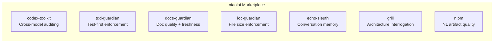

| Plugin | What It Does | Born From |
|--------|-------------|-----------|
| [codex-toolkit](https://github.com/xiaolai/codex-toolkit-for-claude) | Cross-model code auditing via OpenAI Codex | "I need a second pair of eyes that isn't Claude" |
| [tdd-guardian](https://github.com/xiaolai/tdd-guardian-for-claude) | Test-first workflow enforcement | "Coverage keeps dropping when I forget tests" |
| [docs-guardian](https://github.com/xiaolai/docs-guardian-for-claude) | Documentation quality and freshness auditing | "My docs say `com.vmark.app` but the actual identifier is `app.vmark`" |
| [loc-guardian](https://github.com/xiaolai/loc-guardian-for-claude) | Per-file line count enforcement | "This file is 800 lines and nobody noticed" |
| [echo-sleuth](https://github.com/xiaolai/echo-sleuth-for-claude) | Conversation history mining and memory | "What did we decide about that three weeks ago?" |
| [grill](https://github.com/xiaolai/grill-for-claude) | Deep multi-angle code interrogation | "I need architecture review, not just lint" |
| [nlpm](https://github.com/xiaolai/nlpm-for-claude) | Natural language programming artifact quality | "Are my prompts and skills actually well-written?" |

## Before and After

The transformation happened in three months.

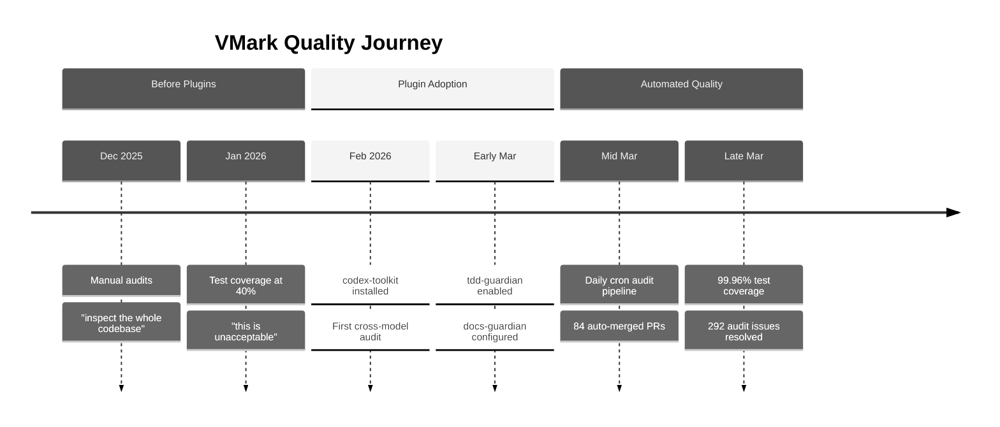

**Before plugins** (December 2025 -- February 2026): Manual code audits. The developer would say things like "inspect the whole codebase, figure out what are possible bugs, gaps." Test coverage hovered around 40% — described as "unacceptable." Documentation was written and forgotten.

**After plugins** (March 2026): Every development session loaded 3--4 plugins automatically. An automated audit pipeline ran daily, creating and resolving issues without human intervention. Test coverage reached 99.96% through a methodical 26-phase ratcheting campaign. Documentation accuracy was verified against code with mechanical precision.

The git history tells the story:

| Category | Commits |
|----------|---------|
| Total commits | 2,180+ |
| Codex audit response | 47 |
| Test/coverage | 52 |
| Security hardening | 40 |
| Documentation | 128 |
| Coverage campaign phases | 26 |

## codex-toolkit: The Second Opinion

**Used in**: 27 of 28 plugin sessions. 200+ Codex calls across all sessions.

The most important thing about codex-toolkit is that it's *not Claude auditing Claude's work*. It sends code to OpenAI's Codex model for independent review. When you've been deep in a feature with one AI, having a completely different model scrutinize the result catches things both you and your primary AI missed.

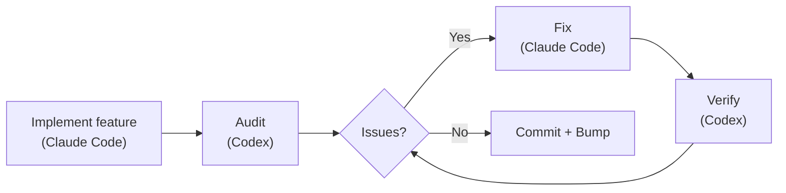

### What It Actually Caught

292 audit issues. All 292 resolved. Zero left open.

Real examples from git history:

- **Security**: 9 findings in a single audit of the secure storage migration ([`d1a880a6`](https://github.com/xiaolai/vmark/commit/d1a880a6)). Symlink traversal in the resource resolver ([`7dfa872d`](https://github.com/xiaolai/vmark/commit/7dfa872d)). Path-to-regexp high severity vulnerability ([`8c554cdc`](https://github.com/xiaolai/vmark/commit/8c554cdc)).

- **Accessibility**: Every popup button was missing `aria-label`. Icon-only buttons in FindBar, Sidebar, Terminal, and StatusBar had no screen reader text ([`7acc0bf0`](https://github.com/xiaolai/vmark/commit/7acc0bf0)). Focus indicator missing on lint badge ([`c4db90d4`](https://github.com/xiaolai/vmark/commit/c4db90d4)).

- **Silent logic bug**: When multi-cursor ranges merged, the primary cursor index silently fell back to 0. Users would be editing at position 50, ranges would merge, and suddenly the cursor would jump to the start of the document. Found by audit, not by testing.

- **i18n spec review**: Codex reviewed the internationalization design spec and found that "the macOS menu-ID migration is not implementable the way the spec says" ([`1208c98d`](https://github.com/xiaolai/vmark/commit/1208c98d)). Four translation quality issues caught across locale files ([`af98b5cd`](https://github.com/xiaolai/vmark/commit/af98b5cd)).

- **Multi-round audit**: The lint plugin went through three rounds — 8 issues first ([`7482c347`](https://github.com/xiaolai/vmark/commit/7482c347)), 6 in the second ([`8bfead81`](https://github.com/xiaolai/vmark/commit/8bfead81)), 7 in the final ([`84cf67f7`](https://github.com/xiaolai/vmark/commit/84cf67f7)). Each round, Codex found issues the fixes had introduced.

### The Automated Pipeline

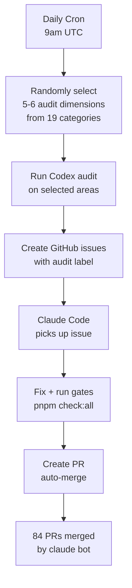

The ultimate evolution: a daily cron audit that runs automatically at 9am UTC. It randomly selects 5--6 dimensions from 19 audit categories, inspects different parts of the codebase, creates labeled GitHub issues, and dispatches Claude Code to fix them. 84 PRs have been auto-created, auto-fixed, and auto-merged by `claude[bot]` — many before the developer even woke up.

### The Trust Signal

When the developer ran an audit and got findings, the response was never "let me review these findings." It was:

> "fix all."

That's the trust level you get when a tool has proven itself hundreds of times.

## tdd-guardian: The Controversial One

**Used in**: 3 explicit sessions. 5,500+ background references across 42 sessions.

tdd-guardian's story is the most interesting because it includes failure.

### The Blocking Hook Problem

tdd-guardian shipped with a PreToolUse hook that blocked commits if test coverage thresholds weren't met. In theory, this enforces test-first discipline. In practice:

> "the TDD-guardian, should we remove blocking hook, let tdd guardian run by manual command?"

The problem was real: a stale SHA in the state file blocked unrelated commits. The developer had to manually patch `state.json` to unblock their work. The blocking hooks were redundant with CI gates that already ran `pnpm check:all` on every PR.

The hooks were disabled ([`f2fda819`](https://github.com/xiaolai/vmark/commit/f2fda819)). But the *philosophy* survived.

### The 26-Phase Coverage Campaign

What tdd-guardian seeded was the discipline that drove an extraordinary coverage campaign:

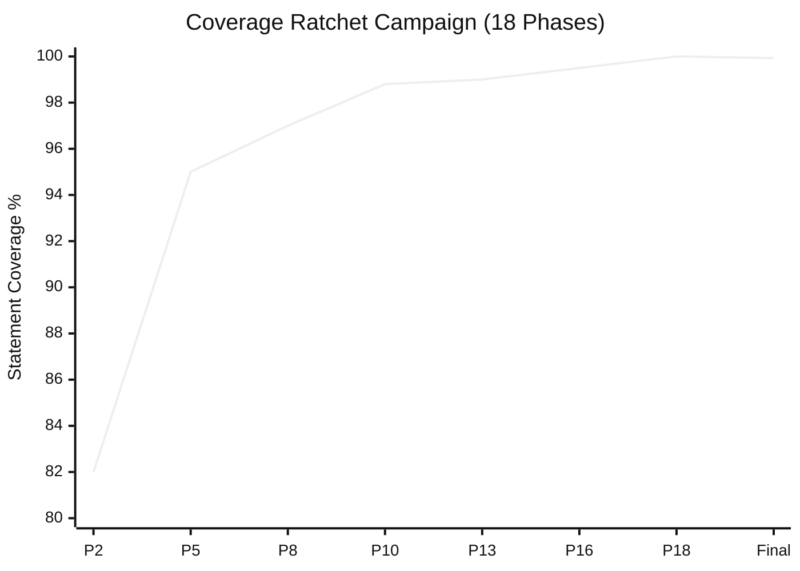

| Phase | Commit | Thresholds |
|-------|--------|-----------|
| Phase 2 | [`1e5cf94a`](https://github.com/xiaolai/vmark/commit/1e5cf94a) | 82/74/86/83 |
| Phase 5 | [`4658d75f`](https://github.com/xiaolai/vmark/commit/4658d75f) | 95/87/95/96 |
| Phase 8 | [`3d7239c3`](https://github.com/xiaolai/vmark/commit/3d7239c3) | deepen tabEscape, codePreview, formatToolbar |
| Phase 13 | [`9bec6612`](https://github.com/xiaolai/vmark/commit/9bec6612) | deepen multiCursor, mermaidPreview, listEscape |
| Phase 16 | [`730ff139`](https://github.com/xiaolai/vmark/commit/730ff139) | v8 annotations across 145 files, 99.5/99/99/99.6 |
| Phase 18 | [`1d996778`](https://github.com/xiaolai/vmark/commit/1d996778) | ratchet to 100/99.87/100/100 |
| Final | [`fcf5e00d`](https://github.com/xiaolai/vmark/commit/fcf5e00d) | 99.93% stmts / 99.96% lines |

From ~40% ("this is unacceptable") to 99.96% line coverage, across 18 phases, each one ratcheting the thresholds higher so coverage could never regress. The test:production ratio reached 1.97:1 — nearly twice as much test code as application code.

### The Lesson

The best enforcement mechanisms are the ones that change your habits, then get out of the way. tdd-guardian's blocking hooks were too aggressive, but the developer who disabled them went on to write more tests than anyone with blocking hooks enabled would have.

## docs-guardian: The Embarrassment Detector

**Used in**: 3 sessions. Found 2 CRITICAL issues on its first audit.

### The `com.vmark.app` Incident

docs-guardian's accuracy checker reads both code and documentation, then compares them. On its first full audit of VMark, it found that the AI Genies guide told users their genies were stored at:

```text
~/Library/Application Support/com.vmark.app/genies/
```

But the actual Tauri identifier in the code was `app.vmark`. The real path was:

```text
~/Library/Application Support/app.vmark/genies/
```

This was wrong on all three platforms, in the English guide and all 9 translated versions. No test would catch this. No linter would catch this. docs-guardian caught it because that's literally what it does: compare code to docs, mechanically, for every mapped pair.

### The Full Audit Impact

```mermaid
%%{init: {"theme": "neutral"}}%%
xychart-beta
    title "Documentation Health Before vs After"
    x-axis ["Accuracy", "Coverage", "Quality", "Overall"]
    y-axis "Score" 0 --> 100
    bar [78, 64, 83, 74]
    bar [95, 91, 88, 91]
```

| Dimension | Before | After | Delta |
|-----------|--------|-------|-------|
| Accuracy | 78/100 | 95/100 | +17 |
| Coverage | 64% | 91% | +27% |
| Quality | 83/100 | 88/100 | +5 |
| **Overall** | **74/100** | **91/100** | **+17** |

17 undocumented features were found and documented in a single session. The Markdown Lint engine — 15 rules, with shortcuts and a status bar badge — had zero user documentation. The `vmark` shell CLI command was completely undocumented. Read-Only Mode, the Universal Toolbar, tab drag-to-detach — all shipped features that users couldn't discover because nobody wrote the docs.

The 19 code-to-doc mappings in `config.json` mean that every time `shortcutsStore.ts` changes, docs-guardian knows `website/guide/shortcuts.md` needs updating. Documentation drift becomes mechanically detectable.

## loc-guardian: The 300-Line Rule

**Used in**: 4 sessions. 14 files flagged, 8 at warning level.

VMark's AGENTS.md contains the rule: "Keep code files under ~300 lines (split proactively)."

This rule didn't come from a style guide. It came from loc-guardian scans that kept finding 500+ line files that were hard to navigate, hard to test, and hard for AI assistants to work with effectively. The worst offender: `hot_exit/coordinator.rs` at 756 lines.

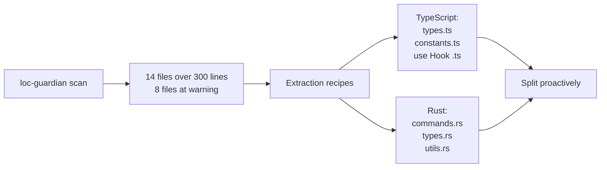

The LOC data also fed into project evaluation — when the developer wanted to understand "how much human effort would this project represent?", the LOC report was the starting input. Answer: $400K--$600K equivalent investment with AI-assisted development.

## echo-sleuth: The Institutional Memory

**Used in**: 6 sessions. Infrastructure for everything.

echo-sleuth is the quietest plugin but arguably the most foundational. Its JSONL parsing scripts are the infrastructure that makes conversation history searchable. When any other plugin needs to recall what happened in a past session, echo-sleuth's tooling does the actual work.

This article exists because echo-sleuth mined 35+ VMark sessions and found every plugin invocation, every user reaction, and every decision point. It extracted the 292-issue count, the 84-PR count, the coverage campaign timeline, and the "grill yourself harshly" session. Without it, the evidence for "why are these plugins indispensable?" would be anecdotal rather than archaeological.

## grill: The Harsh Mirror

**Installed in**: every VMark session. **Invoked explicitly for self-assessment.**

The most memorable grill moment was the March 21 session. The developer asked:

> "If you can grill yourself more harshly, without worrying about time and efforts, what would you do differently?"

grill produced a 14-point quality gap analysis — an 81-message, 863-tool-call session that drove a multi-phase quality hardening plan ([`076dd96c`](https://github.com/xiaolai/vmark/commit/076dd96c), [`5e47e522`](https://github.com/xiaolai/vmark/commit/5e47e522)). Findings included:

- Rust backend test coverage was only 27%
- WCAG accessibility gaps in modal dialogs ([`85dc29fa`](https://github.com/xiaolai/vmark/commit/85dc29fa))
- 104 files exceeding the 300-line convention
- Console.error calls that should have been structured loggers ([`530b5bb7`](https://github.com/xiaolai/vmark/commit/530b5bb7))

This wasn't a linter finding a missing semicolon. This was strategic quality thinking that drove week-long investment campaigns.

## nlpm: The Growing Pain

**Invoked in**: 0 sessions explicitly. **Caused friction in**: 1 session.

nlpm's PostToolUse hook blocked a VMark editing session three times in a row:

> "PostToolUse:Edit hook stopped continuation why?"
> "stop again, why?!"
> "it's harmless... but it's time wasting."

The hook was checking if edited files matched NL artifact patterns. During a bug fix for structural character protection, this was pure noise. The plugin was disabled for that session.

This is honest feedback. Not every plugin interaction is positive. The developer who built nlpm discovered through VMark that PostToolUse hooks on file patterns need better filtering — bug fixes shouldn't trigger NL artifact linting.

## The Five-Phase Evolution

The adoption wasn't instant. It followed a clear trajectory:

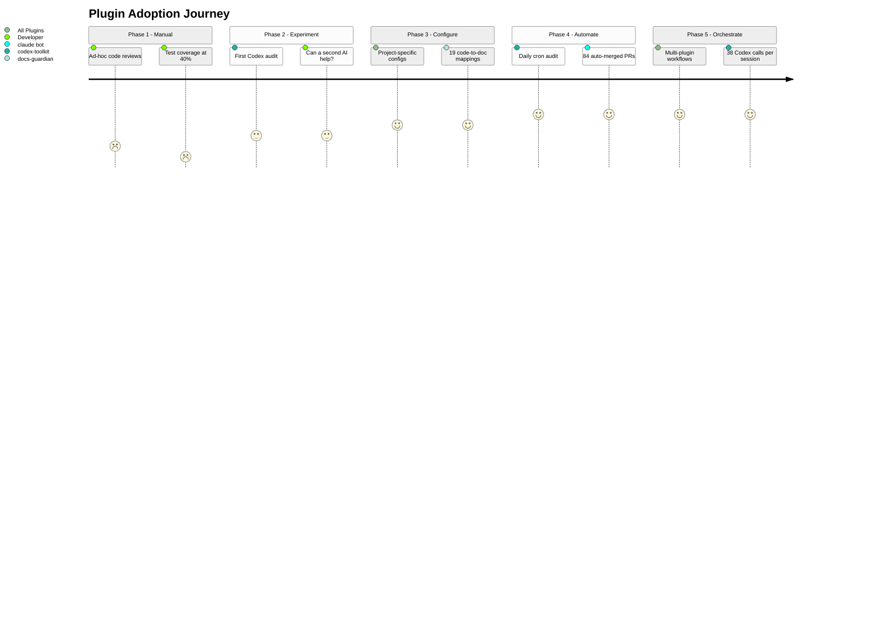

### Phase 1: Manual Auditing (Jan 2026)
> "inspect the whole codebase, figure out what are possible bugs, gaps"

Ad-hoc reviews. No tools. Test coverage at 40%.

### Phase 2: Single Plugin Experiments (Late Jan -- Early Feb)
> "ask codex to review code quality"

First codex-toolkit usage for the MCP server. Experimental. Can a second AI catch things the first missed? First install: [`e6373c7a`](https://github.com/xiaolai/vmark/commit/e6373c7a).

### Phase 3: Configured Infrastructure (Early Mar)
Plugins installed with project-specific configs. tdd-guardian enabled with strict thresholds ([`f775f300`](https://github.com/xiaolai/vmark/commit/f775f300)). docs-guardian has 19 code-to-doc mappings. loc-guardian has 300-line limits with extraction rules.

### Phase 4: Automated Pipelines (Mid Mar)
Daily cron audit at 9am UTC. Issues auto-created, auto-fixed, auto-PRed, auto-merged. 84 PRs without human intervention.

### Phase 5: Multi-Plugin Orchestration (Late Mar)
Single sessions combining loc-guardian scan -> performance audit -> subagent implementation -> codex-toolkit audit -> codex-toolkit verify -> version bump. 38 Codex calls in one session. Plugins compose into workflows.

## The Feedback Loop

The most interesting pattern isn't any individual plugin. It's the loop:

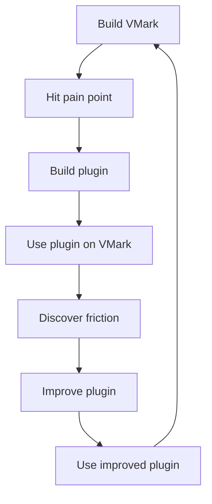

Every plugin was born from building VMark:

- **codex-toolkit** exists because one AI reviewing its own work isn't enough
- **tdd-guardian** exists because coverage kept slipping between sessions
- **docs-guardian** exists because docs always drift from code
- **loc-guardian** exists because files always grow past maintainable sizes
- **echo-sleuth** exists because sessions are ephemeral but decisions aren't
- **grill** exists because architecture problems need adversarial review
- **nlpm** exists because prompts and skills are code too

And every plugin was improved by building VMark:

- tdd-guardian's blocking hooks were found to be too aggressive — leading to a proposal for opt-in enforcement
- nlpm's file pattern matching was found to be too broad — blocking during unrelated bug fixes
- codex-toolkit's naming was fixed after a phantom reference was discovered mid-session
- docs-guardian's accuracy checker proved its value by finding the `com.vmark.app` bug that no other tool could catch

## The Layered Quality System

Together, the seven plugins form a layered quality assurance system:

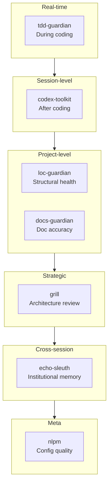

| Layer | Plugin | When It Acts | What It Catches |
|-------|--------|-------------|-----------------|
| Real-time discipline | tdd-guardian | During coding | Skipped tests, coverage regression |
| Session-level review | codex-toolkit | After coding | Bugs, security, accessibility |
| Structural health | loc-guardian | On demand | File growth, complexity creep |
| Documentation sync | docs-guardian | On demand | Stale docs, missing docs, wrong docs |
| Strategic assessment | grill | Periodically | Architecture gaps, testing gaps, quality debt |
| Institutional memory | echo-sleuth | Cross-session | Lost decisions, forgotten context |
| Configuration quality | nlpm | On edit | Poor prompts, weak skills, broken rules |

This is not "optional tooling." It is the governance layer that makes recursive AI development trustworthy — where AI writes the code, AI audits the code, AI fixes the audit findings, and AI verifies the fixes.

## Why They're Indispensable

"Indispensable" is a strong word. Here's the test: what would VMark look like without them?

**Without codex-toolkit**: 292 issues worth of bugs, security vulnerabilities, and accessibility gaps would have accumulated. The automated pipeline that catches issues within 24 hours of introduction wouldn't exist. The developer would rely on manual periodic reviews — which the January sessions show were happening ad-hoc at best.

**Without tdd-guardian**: The 26-phase coverage campaign might not have happened. The discipline of ratcheting thresholds upward — where coverage can only go up, never down — came from the mindset tdd-guardian instilled. 99.96% coverage doesn't happen by accident.

**Without docs-guardian**: Users would still be looking for their genies in a directory that doesn't exist. 17 features would remain undiscoverable. Documentation accuracy would be a matter of hope, not measurement.

**Without loc-guardian**: Files would creep past 500, 800, 1000 lines. The "300-line rule" that keeps the codebase navigable would be a suggestion rather than an enforced constraint.

**Without echo-sleuth**: Every session would start from scratch. "What did we decide about the menu shortcut conflict?" would require manually searching conversation logs.

**Without grill**: The Rust testing gap (27%), the accessibility WCAG gaps, the 104 oversized files — these strategic quality investments were driven by grill's adversarial analysis, not by bug reports.

The plugins aren't indispensable because they're clever. They're indispensable because they encode discipline that humans (and AIs) forget between sessions. Coverage only goes up. Docs match code. Files stay small. Audits happen before every release. These aren't aspirations — they're enforced by tools that run every day.

## The Rules and Skills: Codified Knowledge

Plugins are half the story. The other half is the knowledge infrastructure that accumulated alongside them.

### 13 Rules (1,950 Lines of Institutional Knowledge)

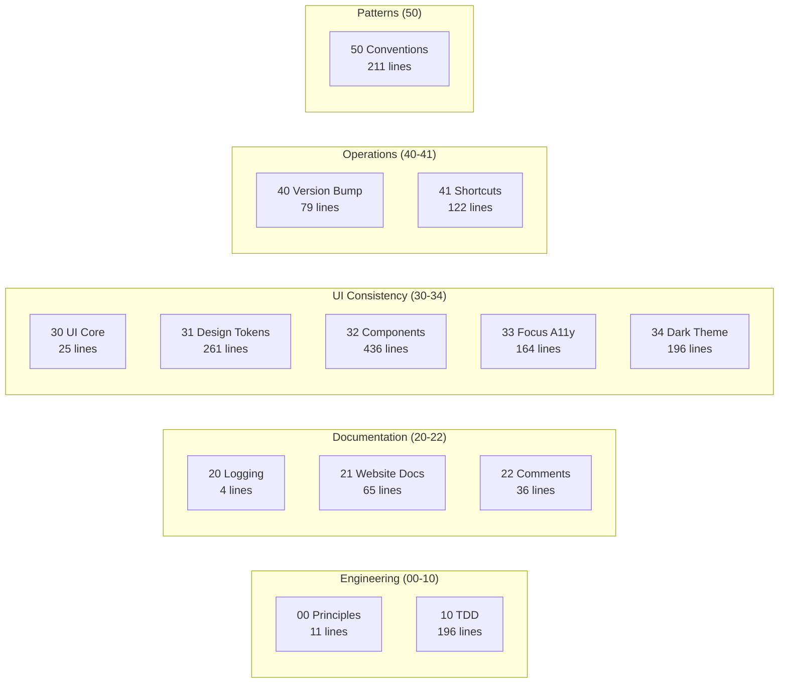

VMark's `.claude/rules/` directory contains 13 rule files — not vague guidelines, but specific, enforceable conventions:

| Rule File | Lines | What It Encodes |
|-----------|-------|----------------|
| `00-engineering-principles.md` | 11 | Core conventions (no Zustand destructuring, 300-line limit) |
| `10-tdd.md` | 196 | 5 test pattern templates, anti-pattern catalog, coverage gates |
| `20-logging-and-docs.md` | 4 | Single source of truth per topic |
| `21-website-docs.md` | 65 | Code-to-doc mapping table (which code changes require which doc updates) |
| `22-comment-maintenance.md` | 36 | When to update/not update comments, rot prevention |
| `30-ui-consistency.md` | 25 | Core UI principles, cross-references to sub-rules |
| `31-design-tokens.md` | 261 | Complete CSS token reference — every color, spacing, radius, shadow |
| `32-component-patterns.md` | 436 | Popup, toolbar, context menu, table, scrollbar patterns with code |
| `33-focus-indicators.md` | 164 | 6 focus patterns by component type (WCAG compliance) |
| `34-dark-theme.md` | 196 | Theme detection, override patterns, migration checklist |
| `40-version-bump.md` | 79 | 5-file version sync procedure with verification script |
| `41-keyboard-shortcuts.md` | 122 | 3-file sync (Rust/Frontend/Docs), conflict checking, conventions |
| `50-codebase-conventions.md` | 211 | 10 undocumented patterns discovered through development |

These rules are read by Claude Code at the start of every session. They're the reason the 2,180th commit follows the same conventions as the 100th.

Rule `50-codebase-conventions.md` is particularly notable — it documents patterns that *nobody designed*. They emerged organically during development and were then codified: store naming conventions, hook cleanup patterns, plugin structure, MCP bridge handler signatures, CSS organization, error handling idioms.

### 19 Project Skills (Domain Expertise)

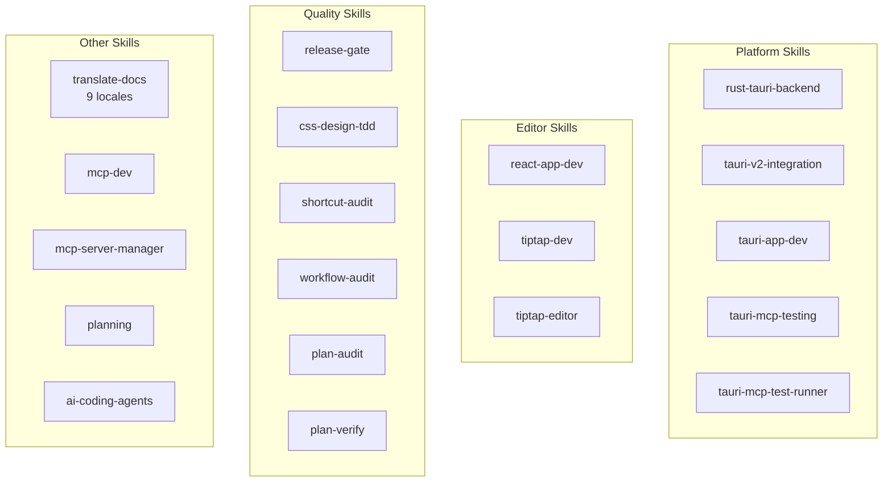

| Category | Skills | What They Enable |
|----------|--------|-----------------|
| **Tauri/Rust** | `rust-tauri-backend`, `tauri-v2-integration`, `tauri-app-dev`, `tauri-mcp-testing`, `tauri-mcp-test-runner` | Platform-specific Rust development with Tauri v2 conventions |
| **React/Editor** | `react-app-dev`, `tiptap-dev`, `tiptap-editor` | Tiptap/ProseMirror editor patterns, Zustand selector rules |
| **Quality** | `release-gate`, `css-design-tdd`, `shortcut-audit`, `workflow-audit`, `plan-audit`, `plan-verify` | Automated quality verification at every level |
| **Documentation** | `translate-docs` | 9-locale translation with subagent-driven audit |
| **MCP** | `mcp-dev`, `mcp-server-manager` | MCP server development and configuration |
| **Planning** | `planning` | Implementation plan generation with decision documentation |
| **AI tooling** | `ai-coding-agents` | Multi-agent orchestration (Codex CLI, Claude Code, Gemini CLI) |

### 7 Slash Commands (Workflow Automation)

| Command | What It Does |
|---------|-------------|
| `/bump` | Version bump across 5 files, commit, tag, push |
| `/fix-issue` | End-to-end GitHub issue resolver — fetch, classify, fix, audit, PR |
| `/merge-prs` | Review and merge open PRs sequentially with rebase handling |
| `/fix` | Fix issues properly — no patches, no shortcuts, no regressions |
| `/repo-clean-up` | Remove failed CI runs and stale remote branches |
| `/feature-workflow` | Gated, agent-driven feature development end-to-end |
| `/test-guide` | Generate manual testing guide |

### The Compound Effect

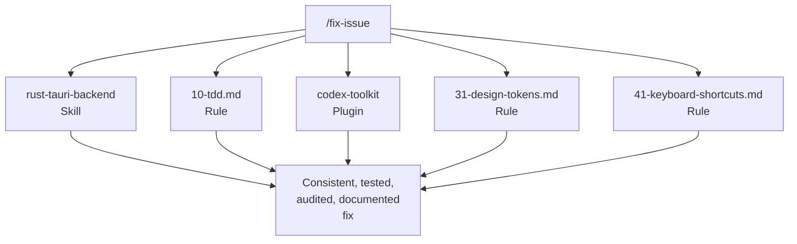

Rules + skills + plugins + commands form a compound system. When you run `/fix-issue`, it uses the `rust-tauri-backend` skill for Rust changes, follows the `10-tdd.md` rule for test requirements, invokes `codex-toolkit` for audit, checks `31-design-tokens.md` for CSS compliance, and verifies against `41-keyboard-shortcuts.md` for shortcut sync.

No single piece is revolutionary. The compound effect — 13 rules x 19 skills x 7 plugins x 7 commands, all reinforcing each other — is what makes the system work. Each piece was added when a gap was discovered, tested in real development, and refined through use.

## For Plugin Builders

If you're thinking about building Claude Code plugins, here's what VMark taught us:

1. **Build for yourself first.** The best plugins solve your actual problems, not hypothetical ones.

2. **Dogfood relentlessly.** Use your plugins on your real projects. The friction you discover is the friction your users will discover.

3. **Hooks need escape hatches.** Blocking hooks that can't be overridden will be disabled entirely. Make enforcement opt-in or context-aware.

4. **Cross-model verification works.** Having a different AI review your primary AI's work catches real bugs. It's not redundant — it's orthogonal.

5. **Encode discipline, not rules.** The best plugins change habits. tdd-guardian's blocking hooks were removed, but the coverage campaign they inspired was the most impactful quality investment in the project.

6. **Compose, don't monolith.** Seven focused plugins beat one mega-plugin. Each does one thing well, and they compose into workflows greater than the sum of their parts.

7. **Trust is earned per-invocation.** The developer trusts codex-toolkit enough to say "fix all" without reviewing findings. That trust was built over 27 sessions and 292 resolved issues.

---

*VMark is open source at [github.com/xiaolai/vmark](https://github.com/xiaolai/vmark). All seven plugins are available in the `xiaolai` Claude Code marketplace.*
